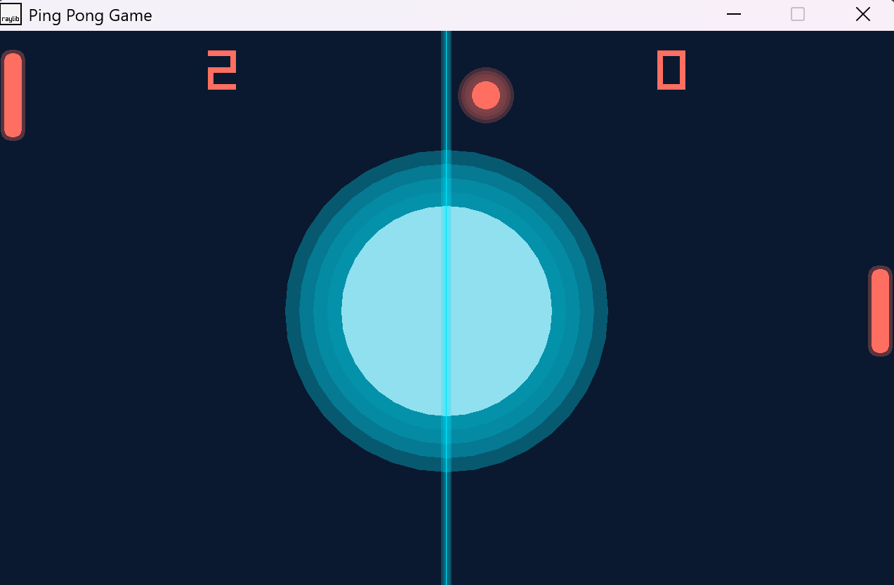

# Ping-Pong Game in C++ using Raylib library

**Pong Game in C++ using Raylib library.**

- It works with raylib version 5.0.
- Tested on Windows 11.

**Gameplay screenshot:**

* Open [Ping-Pong-Game](https://youtu.be/35e6wd_k7oM) video to see the gameplay.
---
